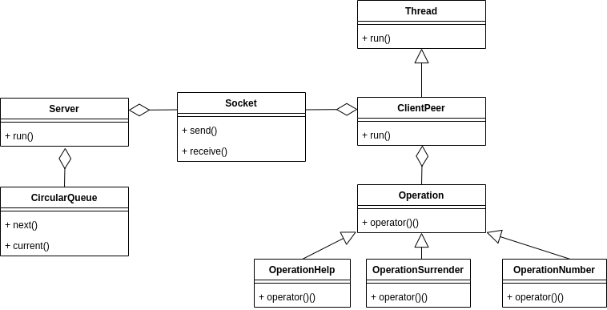

# TP 3 - Adivina el número | Taller 7542

## Trabajo práctico 3 - Programa cliente/servidor adivina el número

### Taller de programación 75.42 - FIUBA

- Alumno: Agustín Emanuel More
- Padrón: 102914
- Repositorio github: https://github.com/moreover22/tp3-taller

Introducción
---

El trabajo consiste en un sistema de modelo cliente/servidor, donde el servidor es capaz de manejar múltiples clientes a la vez. En particular se trata de cada cliente debe adivinar un número que se almacena en el servidor.

Reglas de juego
---

A cada cliente que se conecte al servidor, se le asociará un número que debe adivinar. Se trata de un número de tres dígitos que no cuenta con cifras repetidas. El servidor le responderá con las correciones sobre la entrada que recibió del cliente o bien le indicará si ganó o perdió. El cliente cuenta con diez intentos.

Modelo cliente/Servidor
---

El servidor debe poder comunicarse con múltiples clientes, para esto, en el apartado propio de comunicación se utilizan _Sockets TCP_, y para el manejo de múltiples solicitudes, se utilizarán _Threads_.

Una vez establecida la conexión con el cliente, desde el servidor se inicializará un nuevo hilo, donde se llevará a cabo el resto de la comunicación. 

El formato de los mensajes, establecido por el protocolo, consiste en:
- Mensaje del cliente al servidor:
    - Un caracter indicando el tipo de solicitud (`n` número, `h` ayuda, `s` rendirse). 
    - En el caso de `n` número, se enviarán dos bytes contienen el número que el usuario ingresó (en formato _big endian_).
- Los mensajes del servidor al cliente, son siempre, mensajes en forma de cadena. Con lo cual se envían:
    - Dos bytes indicando la longitud del mensaje.
    - El mensaje en sí.

Servidor
---

El servidor será el encargado de mantener la conexión de todos los clientes y además repartir a cada cliente un número. El mismo recibe por parámetro un archivo con los números que utilizarán. La distribución de los mismos serán bajo el criterio _round robin_ es decir cuando se alcanza el último número de la lista, se vulve a asignar desde el comienzo. Para lograr esto, se implementa una cola circular que se llena al comienzo del programa.

El servidor, una vez inicializado, quedará a la espera de los clientes, cuando llega alguna conexión, el mismo creará un objeto `ClientPeer` que tiene asociado su respectivo _socket_ y _thread_. Una vez inicializado, arranca la ejecución del hilo.

El servidor finalizará, cuando desde el servidor, se ingrese el carácter `q`. Una vez ingresado, se esperará la finalización de las conexiones de los clientes y se liberarán los recursos asociados. Al finalizar, se mostrarán las estadísticas de cantidad de ganadores y perdedores que hubo.

    </img> 

